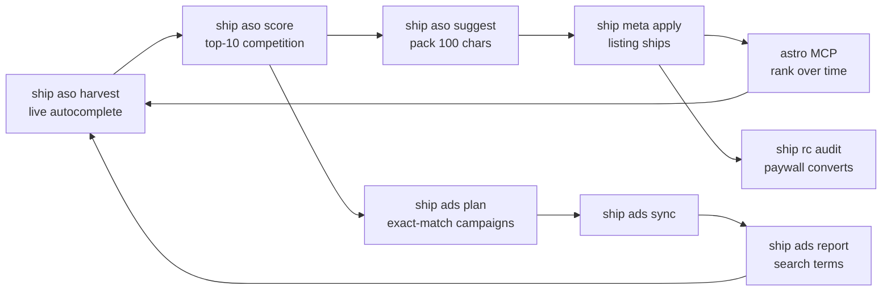

# shipkit

One pipeline for shipping iOS apps: **research → build → ship → grow.**

Every app repo gets a `ship.config.json` and inherits the same CLI, the same MCP
servers, the same store-listing model, and the same gates. Nothing about an app's
identity lives in a script.

```
ship doctor      credentials, tooling, MCP wiring, repo identity
ship init        adopt an existing repo
ship new         scaffold a new one, fully wired

ship aso         keyword research: harvest · score · suggest · apply · competitors · audit
ship meta        store listings: lint · stage · pull · apply · migrate · keywords
ship shots       screenshots: sizes · plan · validate · upload
ship preflight   pre-submission readiness gate

ship build       EAS production build (records the OTA baseline)
ship ota         native-drift check, then eas update
ship submit      upload + submit for review
ship release     preflight → meta → build → submit, gated at every step

ship rc          RevenueCat: status · offerings · products · entitlements · audit
ship ads         Apple Search Ads: status · plan · sync · report
ship status      one dashboard: review state, builds, revenue, ad spend, OTA safety
```

## Install

```bash
ln -sf /home/myen/shipkit/bin/ship ~/.local/bin/ship
ln -sfn /home/myen/shipkit/skills/shipping-ios ~/.claude/skills/shipping-ios
ship doctor
```

Zero npm dependencies. Node ≥ 20. `asc` and `npx eas-cli` are the only external
binaries, and `ship doctor` tells you which one is missing.

## What this replaced

| Before | After |
| --- | --- |
| Release steps written in prose across 21 plan docs, retyped by hand every time | `ship release` |
| Metadata pushed from `store/apply-when-ready.sh` in one repo, the ASC web UI in another, nothing in the third | `ship meta apply`, same everywhere |
| Two incompatible metadata layouts (canonical JSON in `idea6`, legacy `.strings` in `tour`) | one authored `store/staged/<locale>.json`, `ship meta migrate` bridges the old one |
| Four Python scripts for keyword research in one repo, strategy prose in another, nothing in the third | `ship aso` |
| "prefer a fresh build, OTA has repeatedly broken on native-dep drift" as a comment in a plan doc | `ship ota` refuses, with the diff |
| Paywall breakage discovered by users | `ship rc audit` inside `ship preflight` |
| Apple Search Ads as a paragraph of intent | `ship ads plan` → `ship ads sync` |

## The model

### One config

`ship.config.json` at each repo root. `ship init` writes it by auto-detection;
`schema/ship.config.schema.json` documents every field.

```jsonc
{
  "name": "Glovebox",
  "bundleId": "com.idea6.carmaintenancelog",
  "appDir": ".",                    // "mobile" for repos that nest the Expo app
  "asc":        { "appId": "6797103341", "primaryLocale": "en-US" },
  "eas":        { "projectId": "…", "profile": "production", "channel": "production" },
  "store":      { "dir": "store", "locales": ["en-US", "de-DE", …] },
  "revenuecat": { "projectId": "projf0d996da", "entitlement": "pro", "keyEnv": "EXPO_PUBLIC_RC_IOS_KEY" },
  "ads":        { "orgId": null, "dir": "aso/asa" },
  "aso":        { "dir": "aso", "markets": ["us"], "seeds": [] },
  "legal":      { "privacyUrl": "https://…", "supportUrl": "https://…" }
}
```

### One listing format

Author in `store/staged/<locale>.json`. One file per locale, human-editable, with
an optional `notes` block recording *why* each keyword was chosen — the reasoning
survives the next person.

`ship meta stage` expands those into the canonical tree `asc` consumes:

```
store/staged/de-DE.json          ← you edit this
store/app-info/de-DE.json        ← generated
store/version/1.0/de-DE.json     ← generated
```

Never hand-edit the generated tree; `stage` overwrites it.

### Gates, not documentation

Each wrapper carries a rule that was previously a sentence in a plan doc that
someone had to remember:

- **`ship meta apply`** refuses unless the ASC version state is `READY_FOR_SALE`,
  `PREPARE_FOR_SUBMISSION`, `DEVELOPER_REJECTED`, or `REJECTED`. It then runs
  `asc metadata apply` **twice** — the first pass creates empty localizations and
  reports "entity with locale already exists", the second fills them. Only
  second-pass failures are real.
- **`ship ota`** refuses when the native dependency graph or native Expo config
  keys drifted since the last `ship build`. Both `tour` and `idea6` recorded the
  same incident: an OTA against changed native deps breaks every installed client.
  The baseline is `.asc/native-lock.json`, written by `ship build`.
- **`ship meta lint`** fails on `", "` in the keywords field (a space after each
  comma wastes one indexed character per term) and warns when a keyword is
  already covered by `name` or `subtitle` (Apple indexes those anyway, so the
  slot is spent for nothing).
- **`ship rc audit`** fails on the four things that ship a dead paywall: no
  current offering, a current offering with zero packages, a RevenueCat bundle id
  that disagrees with the build, a missing entitlement.

## Research → listing → ads

The three growth surfaces are one loop, in this order:



Bid only on terms the listing already targets. Bidding on terms your metadata
ignores is paying Apple to compensate for your ASO.

`ship aso` scores each term 0-100 for `opportunity`, weighting weak incumbents
(40%), low review moat (35%), and few exact-title matches (25%). Sort by it.

## MCP servers

Three, wired into every repo by `ship init`. See [`mcp/README.md`](mcp/README.md)
for credentials.

| Server | Owns | Note |
| --- | --- | --- |
| `revenuecat` | products, entitlements, offerings, paywalls, revenue | hosted, key from `~/.omp/revenuecat.key` |
| `astro` | keyword rank over time, popularity/difficulty, competitor keywords | **macOS app**; reach it over an SSH tunnel |
| `apple-ads` | campaigns, ad groups, bids, search-term reports | 74 tools over Campaign Management API v5 |

**MCP is for conversation. The CLI is for determinism.** They hit the same APIs.
Don't automate through MCP; don't explore through CI.

## CI

Copy from `ci/` into `<repo>/.github/workflows/`.

- **`release.yml`** — ubuntu. `doctor → preflight → meta apply → build → submit`.
  Defaults to `dry_run: true`. No macOS minutes: every step is either HTTP against
  App Store Connect or an EAS cloud build.
- **`screenshots.yml`** — macOS. The only job that needs a Mac.
- **`growth.yml`** — weekly keyword re-harvest, RevenueCat audit, ad report. Opens
  an issue **only** when the recommendation actually changed.

Secrets: `ASC_KEY_ID`, `ASC_ISSUER_ID`, `ASC_PRIVATE_KEY`, `EXPO_TOKEN`,
`REVENUECAT_V2_KEY`, and the `ASA_*` set when Search Ads is live.

## Why there is no fastlane

fastlane was evaluated and deliberately left out. Every lane it would contribute
is already covered by a tool that works here, and adding it would mean two
conventions for the same job:

| fastlane | already covered by | why |
| --- | --- | --- |
| `deliver` | `asc metadata` / `ship meta` | same API; `asc` is installed, authenticated, and has the keyword tooling |
| `pilot` | `asc testflight` | same API |
| `precheck` | `ship preflight` | plus RevenueCat, OTA, and version-coherence checks fastlane has no concept of |
| `match` | EAS-managed credentials | EAS already owns signing; `match` would mean a second certificate store |
| `gym` | EAS Build | needs Xcode; this host is Linux |
| `frameit` | `asc screenshots` | same |

The one lane fastlane genuinely owns is **`snapshot`** — and it drives an
XCUITest target inside an Xcode project. These are managed Expo apps with no
committed Xcode project, so `snapshot` would require ejecting to a bare workflow
purely to take pictures. `ci/screenshots.yml` uses Maestro on a macOS runner
instead, which drives the simulator with no native test target at all.

If a repo ever moves to a bare workflow with a committed Xcode project, revisit
this — `snapshot` becomes viable and `ship shots upload` still handles the
App Store side.

## Layout

```
bin/ship                  entry point
src/cli.mjs               command registry + arg parsing
src/config.mjs            ship.config.json load/normalise/save
src/exec.mjs              run/runJSON, asc(), eas(), fetchJSON, which()
src/log.mjs               Report, table, ShipError, colour
src/lib/locales.mjs       staged ⇄ canonical listing model, lint, .strings parser
src/lib/appstore.mjs      autocomplete harvest, competition scoring, keyword packing
src/lib/revenuecat.mjs    v2 REST client + paywall audit
src/lib/native.mjs        OTA-vs-build decision
src/commands/*.mjs        one module per command
mcp/servers.json          canonical MCP definitions merged into each repo
skills/shipping-ios/      the skill agents load before touching a release
templates/                `ship new` scaffold
ci/                       GitHub Actions workflows
schema/                   JSON Schema for ship.config.json
```
