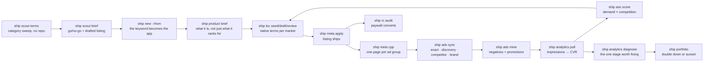

# shipkit

One pipeline from a keyword to a localized, advertised app:
**scout → build → ship → grow.**

Every app repo gets a `ship.config.json` and inherits the same CLI, the same MCP
servers, the same store-listing model, and the same gates. Nothing about an app's
identity lives in a script.

```
ship doctor      credentials, tooling, MCP wiring, repo identity
ship init        adopt an existing repo
ship new         scaffold a new one, fully wired  (--from a scout brief)

ship scout       before a repo exists: terms · brief · new
ship product     what the app is, drafted from the scout brief and gated: brief
ship research    competitor evidence from the storefront: plan · fetch · capture · verify · index
ship aso         keyword research: harvest · volume · score · suggest · apply · competitors · audit
ship design      token and screen contracts: system · spec · review
ship qa          simulator-free quality gate over the built screens: run · check · baseline
ship loc         localization: seed · draft · review · lock · status
ship meta        store listings: lint · stage · pull · apply · migrate · keywords · cpp
ship shots       screenshots: sizes · capture · render · verify · figma · plan · validate · upload
ship preflight   pre-submission readiness gate

ship build       EAS production build (records the OTA baseline)
ship ota         native-drift check, then eas update
ship submit      upload + submit for review
ship release     preflight → meta → build → submit, gated at every step

ship rc          RevenueCat: status · offerings · products · entitlements · audit
ship ads         Apple Search Ads: status · plan · snapshot · sync · mine · report
ship analytics   App Store analytics: pull · terms · funnel · onboarding · diagnose
ship price       territory pricing: show · plan · apply · audit
ship status      one dashboard: review state, builds, revenue, ad spend, OTA safety
ship portfolio   every app at once: revenue, spend, staleness, sunset candidates
```

## Install

```bash
ln -sf /home/myen/shipkit/bin/ship ~/.local/bin/ship
ln -sfn /home/myen/shipkit/skills/shipping-ios ~/.claude/skills/shipping-ios
ln -sfn /home/myen/shipkit/skills/researching-apps ~/.claude/skills/researching-apps
ln -sfn /home/myen/shipkit/skills/designing-apps ~/.claude/skills/designing-apps
ship doctor
```

Zero npm dependencies. Node ≥ 20. `asc` and `npx eas-cli` are the only external
binaries, and `ship doctor` tells you which one is missing.

## What this replaced

| Before | After |
| --- | --- |
| Release steps written in prose across 21 plan docs, retyped by hand every time | `ship release` |
| Metadata pushed from `store/apply-when-ready.sh` in one repo, the ASC web UI in another, nothing in the third | `ship meta apply`, same everywhere |
| Two incompatible metadata layouts (canonical JSON in `idea6`, legacy `.strings` in `tour`) | one authored `store/staged/<locale>.json`, `ship meta migrate` bridges the old one |
| Four Python scripts for keyword research in one repo, strategy prose in another, nothing in the third | `ship aso` |
| "prefer a fresh build, OTA has repeatedly broken on native-dep drift" as a comment in a plan doc | `ship ota` refuses, with the diff |
| Paywall breakage discovered by users | `ship rc audit` inside `ship preflight` |
| Apple Search Ads as a paragraph of intent | `ship ads plan` → `ship ads sync` |

## The model

### One config

`ship.config.json` at each repo root. `ship init` writes it by auto-detection;
`schema/ship.config.schema.json` documents every field.

```jsonc
{
  "name": "Glovebox",
  "bundleId": "com.idea6.carmaintenancelog",
  "appDir": ".",                    // "mobile" for repos that nest the Expo app
  "asc":        { "appId": "6797103341", "primaryLocale": "en-US" },
  "eas":        { "projectId": "…", "profile": "production", "channel": "production" },
  "store":      { "dir": "store", "locales": ["en-US", "de-DE", …] },
  "revenuecat": { "projectId": "projf0d996da", "entitlement": "pro", "keyEnv": "EXPO_PUBLIC_RC_IOS_KEY" },
  "ads":        { "orgId": null, "dir": "aso/asa", "targetCpi": 1.50, "subPrice": 4.99, "retentionMonths": 1, "seedBid": 0.60, "baselineInstallRate": 0.4, "retain": 12 },
  "aso":        { "dir": "aso", "seeds": [], "seedsByLocale": { "de-DE": ["kfz scheckheft"] }, "minVolume": 10 },
  "loc":        { "sourceLocale": null, "glossary": "store/glossary.json" },
  "analytics":  { "dir": ".asc/analytics" },
  "price":      { "dir": "store/pricing", "basePriceUsd": 4.99 },
  "legal":      { "privacyUrl": "https://…", "supportUrl": "https://…", "euTrader": true }
}
```

### One listing format

Author in `store/staged/<locale>.json`. One file per locale, human-editable, with
an optional `notes` block recording *why* each keyword was chosen — the reasoning
survives the next person.

`ship meta stage` expands those into the canonical tree `asc` consumes:

```
store/staged/de-DE.json          ← you edit this
store/app-info/de-DE.json        ← generated
store/version/1.0/de-DE.json     ← generated
```

Never hand-edit the generated tree; `stage` overwrites it.

### Gates, not documentation

Each wrapper carries a rule that was previously a sentence in a plan doc that
someone had to remember:

- **`ship meta apply`** refuses unless the ASC version state is `READY_FOR_SALE`,
  `PREPARE_FOR_SUBMISSION`, `DEVELOPER_REJECTED`, or `REJECTED`. It then runs
  `asc metadata apply` **twice** — the first pass creates empty localizations and
  reports "entity with locale already exists", the second fills them. Only
  second-pass failures are real.
- **`ship ota`** refuses when the native dependency graph or native Expo config
  keys drifted since the last `ship build`. Both `tour` and `idea6` recorded the
  same incident: an OTA against changed native deps breaks every installed client.
  The baseline is `.asc/native-lock.json`, written by `ship build`.
- **`ship meta lint`** fails on `", "` in the keywords field (a space after each
  comma wastes one indexed character per term) and warns when a keyword is
  already covered by `name` or `subtitle` (Apple indexes those anyway, so the
  slot is spent for nothing).
- **`ship rc audit`** fails on the four things that ship a dead paywall: no
  current offering, a current offering with zero packages, a RevenueCat bundle id
  that disagrees with the build, a missing entitlement.
- **`ship preflight`** asks App Store Connect what screenshots are actually
  attached to the primary locale, and fails when there is no iPhone set. A
  version with zero iPhone screenshots is bounced before a human sees it, and
  `asc validate` does not always say so.
- **`ship shots validate`** measures every PNG/JPEG header against the live
  `asc screenshots sizes` matrix and, when a capture fits a *different* display
  type, names the directory it belongs in — most rejections here are a `mv`.
- **`ship shots render`** refuses to typeset a caption it cannot fit, instead of
  shipping a clipped one, and `ship shots verify` refuses a caption-band render
  that changed a single pixel outside the band — the property that made the mode
  legal in the first place.
- **`ship scout brief`** refuses an idea, with the number that killed it: a top-3
  review median over 50,000 with a free tier present, demand under the floor, or
  more than 6 of the top 10 carrying the term in their title. The brief is
  written either way — a NO-GO you can read beats a hunch you cannot.
- **`ship loc review`** fails a locale whose copy is a byte-identical clone of the
  source, whose keywords overlap the source heavily but have **no support in that
  locale's own harvest** (`translated-not-harvested`), whose glossary
  `neverTranslate` terms got translated, or whose German copy says GDPR instead of
  DSGVO. Every length check counts **code points**, because German compounds and
  CJK blow a 30-character subtitle that `String.length` says is fine.
- **`ship preflight`** additionally fails on the mechanical review blockers:
  a missing `ITSAppUsesNonExemptEncryption` (which stalls every build before review
  even starts), an incomplete age rating, unanswered content rights, absent privacy
  labels, a dead support URL, and `legal.euTrader` unset while any EU locale ships
  — an undeclared trader is removed from EU storefronts outright.
- **`ship price apply`** refuses to move any territory price by more than 50%
  without `--force`. Price changes are visible to existing subscribers and are not
  casually reversible.
- **`ship portfolio`** names sunset candidates by rule — under $10/mo, older than
  90 days, no release in 60 — so an app cannot quietly consume attention because
  you forgot it exists.

## Screenshots, without a Mac

`ship shots plan|validate|upload` is the file-driven half: it measures the PNGs
in `store/screenshots/<locale>/<displayType>/`, gates them against the live
`asc screenshots sizes` matrix, and uploads them. A repo that brings finished
images from a Mac or a designer needs nothing else, and nothing below runs.

A repo may instead commit a **design spec** — `store/figma-geometry.json`,
transcribed once from the Figma node tree — and then build those images here.
There is still no simulator; there are two honest substitutes, and which one an
app can use is a property of the app, not a preference:

| | `device-frame` | `caption-band` |
| --- | --- | --- |
| where the app pixels come from | the app's own web build, driven headless at device pixel size | the finished composites Apple is already serving |
| what gets rebuilt | the whole frame: mockup layers + capture + caption | the caption band, nothing else |
| needs | a UI that React Native Web renders faithfully | a design whose caption sits on flat background |
| localizes the app UI | yes — strings come from the app's own i18n bundle | no — captions only |

```sh
ship shots capture               # raw inputs: web-build screens, or the live composites
ship shots render de-DE fr-FR    # composite raw + captions into store/screenshots/
ship shots verify                # calibration + safety, against the design's own reference
ship shots upload --render --replace
```

`--render` runs both halves over one scope resolution, which is the only way
they stay coherent: with `--locale`, render narrows and upload takes the
per-locale path; without it, render covers every configured locale because
upload is asc's app-scoped fan-out across every locale directory on disk. Render
half of them and the fan-out ships the stale half beside the fresh one.

### Figma is a quota, not a service

`GET /v1/images` serves a handful of exports a day on the starter plan and then
429s. So every design input — mockup layer PNGs, the reference render, the node
geometry — is fetched **once** and committed under `store/`. They are build
inputs in git, not a cache: losing them blocks rendering until the quota resets.

The cost of that trade is staleness, and `ship shots figma` is what pays it
down. The default is a drift check against the file's `version`, which is a
*different* endpoint and costs nothing — so a design edit is detectable on a day
when exports are exhausted. `--export` is the only thing that spends quota, it
is never implicit, and a 429 keeps the committed copies and says so.

### What the numbers mean

`ship shots verify` is the evidence, per mode:

- **device-frame** re-renders the source locale and diffs it against the design
  tool's own export, excluding the glass (the reference holds placeholder
  screens) and the caption (two rasterisers never agree on antialiased 128px
  type). What is left is background and bezel placement: **1.7–2.3%** of pixels
  on stallbook, essentially all of it the phone body's one-pixel rim.
- **caption-band** re-renders the source locale and compares caption ink width
  with the live image — **0px** on five of glovebox's six frames, the sixth
  exempted in the spec because its copy deliberately changed — then asserts
  that every rendered locale differs from the base **nowhere outside the band**:
  0, across 16 locales.

### Two things that are not obvious

**Wrapping.** Figma wraps greedily inside each frame's own text box. A balanced
wrap reads better and breaks lines where the designer did not — it split
glovebox's frame 2 as `Log a service / in 15 seconds.` where Figma had `Log a
service in 15 / seconds.`. `type.wrap` picks one; match the source of truth, not
the prettier algorithm.

**The face, not the weight.** Captions are rendered as glyph outlines from an
explicit font file, never as text handed to a rasteriser, because a family-name
lookup resolves differently on a CI runner and substitutes silently. And the
file matters: variable Oswald at `wght=600` is not the static SemiBold — its
wider space advance drifted caption widths ~14px against the reference. A
variable face used deliberately needs its instance named
(`{"file": …, "variation": {"wght": 700}}`), or it opens on Regular and every
caption comes out light and narrow.

## Keyword → app → locale → ads → back

One loop. Nothing in it is advice; every arrow is a command whose output is the
next one's input.



Bid only on terms the listing already targets. Bidding on terms your metadata
ignores is paying Apple to compensate for your ASO. `ship ads mine` enforces the
other direction too: a term that converts on paid and is missing from the organic
listing is the highest-value listing edit available at any moment, and it says so.

### The score

`opportunity = demand ÷ 100 × competition`, both 0-100, and the product is
deliberate.

`competition` is the supply side alone — weak incumbents (40%), low review moat
(35%), few exact-title matches (25%). That number used to *be* the ranking, which
meant the pipeline's top recommendation was reliably a keyword nobody searches.
An uncontested term with no traffic is worth exactly nothing, so demand zeroes it
instead of ranking it first.

`demand` comes from the best source available, in this order:

| Source | Where | Why it wins |
| --- | --- | --- |
| measured impressions | `.asc/analytics/<locale>-terms.json` | real users typed it; 0 impressions is a disproved guess, not an unknown |
| popularity file | `aso/<locale>/volume.json`, hand-written, from the astro MCP, or a saved Apple Ads Platform API v1 response | a human or a paid dataset knows better than a heuristic |
| autocomplete rank | `aso/<locale>/candidates.json` | Apple orders hints by popularity, so position is a free volume proxy — and a term several different seeds surface is a hub term, not a long-tail accident |

### Evidence, not vocabulary

A category sweep comes back full of store brands: `valvoline instant oil change`
scores beautifully because the only app that matches is the one being named. Three
filters keep them out of your own listing, all of them evidence-based:

- publisher names come free with the search API's `sellerName`, but a seller token
  the market types anyway (`service`) is rescued by its query support — banning
  every word of "Express Oil Change Service Company LLC" once banned the category;
- the keyword pool is **tokens, not phrases**, because Apple indexes the field word
  by word — filtering whole queries dropped `vehicle` for the crime of standing
  next to `mileage`;
- the subtitle holds to a higher bar than the keyword field (three separate queries
  per token), because 30 indexed characters are too expensive to spend on a company.

Branded terms are not discarded — `ship ads plan` routes them into the Competitor
campaign, where bidding on a rival's name is a decision you can see and price.

## Paid acquisition: two files, one identity, one threshold

`ship ads` spends real money, so three properties are structural rather than
advisory. Each one is here because its absence cost a live account its delivery
in a single command.

**Desired state and observed state are different files.** `aso/asa/campaign-plan.json`
is what you want; `aso/asa/snapshot.json` (`ship ads snapshot`) is what Apple has,
including ids, statuses, bids, negatives and per-object performance. `ship ads sync`
reconciles them and prints every transition — create, update, adopt, preserve,
pause, orphan — *before* issuing any of it, so `--dry-run` and a real run print the
same list by construction.

**Objects are matched by Apple's id, not by name.** Ids are recorded back into the
plan under `apple` after each sync. A name is a label a human edits: matching by
name means renaming your scheme orphans every object you have already paid to
learn about, and the previous ones look "unplanned" and get paused. Nothing is
paused without `--prune`; nothing that changed outside `ship` is overwritten
without `--force` (the plan wins) or `--adopt` (the account wins). Either way the
divergent objects are named and the default is to refuse and exit non-zero.

**A plan bound to a live account is not regenerable.** `ship ads plan` builds from
`scored.json`, so once ids are recorded — and once a bid is hand-set, an ad group
pruned or a keyword added outside the ASO set — a replan silently drops all of it,
after which `ship ads sync --force` reverts the account to match. `plan` therefore
refuses to overwrite a plan carrying Apple ids: `--render` rewrites
`campaign-plan.md` alone from the JSON on disk (no scores, no credentials, no
replan), and `--force` replans anyway, keeping the previous plan as
`campaign-plan.prev.json`. The generated document reads its summary from the
campaigns rather than the stamped `params`, and says so when the two disagree —
a doc claiming $30/day above campaigns totalling $32 is how a hand edit gets
reverted by the next person to run the generator.

**A bid is a price in an auction, not a share of a budget.** Bids start from the
account's own realised cost-per-tap where there is one, else `ads.seedBid`
(default $0.60 — deliberately not Apple's $0.30 floor, which loses every
auction), scaled by demand and clamped. A plan in which *every* bid hit the clamp
is refused rather than written: that is a single price wearing an opportunity
model. `--bid` / `--min-bid` / `--max-bid` set it by hand.

**Apple Search Ads has no ad-group budget.** `dailyBudgetAmount` exists on the
campaign and nowhere else, so no ad group in a plan carries one. One ad group per
keyword is justified on *creative* control — an ad group is the smallest object
that can carry its own Custom Product Page and its own bid — and never on budget
isolation, which the platform cannot provide.

**One kill threshold, resolved once and stamped into every artifact.** `ads.targetCpi`
is the only source; `ads.subPrice` sets breakeven and is never a fallback for a
missing target. Negation needs a sample size as well as a bill: zero installs over
three taps is noise, not a verdict, so `ship ads mine` withholds a negation until
the tap count at which a keyword converting at `ads.baselineInstallRate` would
have converted with 95% probability — 6 taps at the 0.4 default — and prints what
it is waiting for. `--apply` requires `--confirm`, after printing the evidence.

**A CPI target means nothing without an LTV.** `ship ads plan` and `ship ads sync`
read the configured RevenueCat project and refuse to be quiet about a zero: with
0 subscriptions and $0 revenue, every threshold is labelled a *research cap*
rather than a target, and `ship ads report` prints install→paid beside CPI so the
whole funnel is one command. Silence there is how $10/day survives a review.

```
ship ads plan --budget 10 --bid 0.55   # offline apart from the CPT and LTV reads
ship ads plan --render                 # campaign-plan.md from campaign-plan.json, nothing recomputed
ship ads snapshot                      # observed state, with ids
ship ads sync --dry-run                # the mutation set, exactly
ship ads report --level ad-group       # where a bid regression is visible
ship ads mine --apply --confirm        # negatives + promotions, with evidence
```

**Migrating a plan written before ids were recorded.** Nothing to do by hand: a
plan with no `apple` block is adopted by name on the next sync, which records the
ids. Where such a plan's values differ from the live account, sync refuses and
names each object, because a plan that has never been pushed cannot tell its own
intent apart from somebody's manual fix — resolve it once with `--adopt` (keep the
live bids, usually right) or `--force` (push the plan), and every later run
reconciles by id.

## MCP servers

Three, wired into every repo by `ship init`. See [`mcp/README.md`](mcp/README.md)
for credentials.

| Server | Owns | Note |
| --- | --- | --- |
| `revenuecat` | products, entitlements, offerings, paywalls, revenue | hosted, key from `~/.omp/revenuecat.key` |
| `astro` | keyword rank over time, popularity/difficulty, competitor keywords | **macOS app**; reach it over an SSH tunnel |
| `apple-ads` | campaigns, ad groups, bids, search-term reports | 74 tools over Campaign Management API v5 — [sunsets 2027-01-26](docs/apple-ads-platform-api.md) |

**MCP is for conversation. The CLI is for determinism.** They hit the same APIs.
Don't automate through MCP; don't explore through CI.

## CI

Copy from `ci/` into `<repo>/.github/workflows/`. Every one of them bootstraps
through this repo's composite action, so there is no tool install to copy and the
`@ref` in `uses:` is the version pin:

```yaml
- uses: orangutanger1/shipkit/.github/actions/setup@main
```

- **`ota.yml`** — ubuntu, on every push to main. `ship ota --check` decides:
  fingerprint unchanged → publish the JS update; native drift → open an issue
  asking for a build, because an OTA would crash installed clients. This is the
  daily path; `release.yml` is the rare one.
- **`release.yml`** — ubuntu. One `ship release` call: `preflight → meta stage →
  meta apply → build → submit`, aborting on the first failure. Gated by the
  `production` GitHub environment rather than by a dry-run default, so a reviewer
  approves once instead of every operator paying for two runs. No macOS minutes:
  every step is either HTTP against App Store Connect or an EAS cloud build.
- **`screenshots.yml`** — macOS, the only job that needs a Mac. The simulator
  build happens once and every device in the capture matrix downloads that
  artifact; Xcode is pinned, because it decides the pixel dimensions Apple accepts.
- **`growth.yml`** — weekly keyword re-harvest, RevenueCat audit, ad report.
  Comments on one open issue **only** when the committed research actually
  changed, and one throttled locale never costs the others their refresh.

Secrets: `ASC_KEY_ID`, `ASC_ISSUER_ID`, `ASC_PRIVATE_KEY`, `EXPO_TOKEN`,
`REVENUECAT_V2_KEY`, and the `ASA_*` set when Search Ads is live.
Optional repo variables: `ASC_VERSION`, `MAESTRO_VERSION`, `XCODE_VERSION` — set
them when a release has to be byte-reproducible; blank means latest.

Dispatch inputs are never interpolated into a `run:` body. They arrive through
`env:` and are referenced as shell variables, because a `workflow_dispatch` input
is attacker-controlled text and these jobs hold the App Store Connect key.

## Why there is no fastlane

fastlane was evaluated and deliberately left out. Every lane it would contribute
is already covered by a tool that works here, and adding it would mean two
conventions for the same job:

| fastlane | already covered by | why |
| --- | --- | --- |
| `deliver` | `asc metadata` / `ship meta` | same API; `asc` is installed, authenticated, and has the keyword tooling |
| `pilot` | `asc testflight` | same API |
| `precheck` | `ship preflight` | plus RevenueCat, OTA, and version-coherence checks fastlane has no concept of |
| `match` | EAS-managed credentials | EAS already owns signing; `match` would mean a second certificate store |
| `gym` | EAS Build | needs Xcode; this host is Linux |
| `frameit` | `asc screenshots` | same |

The one lane fastlane genuinely owns is **`snapshot`** — and it drives an
XCUITest target inside an Xcode project. These are managed Expo apps with no
committed Xcode project, so `snapshot` would require ejecting to a bare workflow
purely to take pictures. `ci/screenshots.yml` uses Maestro on a macOS runner
instead, which drives the simulator with no native test target at all.

If a repo ever moves to a bare workflow with a committed Xcode project, revisit
this — `snapshot` becomes viable and `ship shots upload` still handles the
App Store side.

## Layout

```
bin/ship                  entry point
src/cli.mjs               command registry + arg parsing
src/config.mjs            ship.config.json load/normalise/save
src/exec.mjs              run/runJSON, asc(), eas(), fetchJSON, which()
src/log.mjs               Report, table, ShipError, colour
src/lib/text.mjs          locale-aware tokens: Intl.Segmenter words, code-point counts, brands, support
src/lib/locales.mjs       staged ⇄ canonical listing model, lint, .strings parser
src/lib/cpp.mjs           custom product pages: model, lint, stage, ad-group binding
src/lib/color.mjs         sRGB hue and WCAG contrast — the design gate's arithmetic
src/lib/design-system.mjs one accent, both themes legible, one spacing series, cited tokens
src/lib/design-spec.mjs   screens reachable, events derived, every string specified
src/lib/design-review.mjs the same rules against the implementation, line by line
src/lib/appstore.mjs      autocomplete harvest, demand × competition scoring, keyword packing
src/lib/revenuecat.mjs    v2 REST client + paywall audit
src/lib/native.mjs        OTA-vs-build decision
src/lib/img-size.mjs      PNG/JPEG dimensions from the file header — no image library
src/lib/shots-spec.mjs    the committed design spec: modes, geometry, type, validation
src/lib/shots-type.mjs    caption wrapping (greedy vs balanced), size fitting, glyph outlines
src/lib/shots-render.mjs  compositing both modes, plus calibration and safety diffs
src/lib/shots-capture.mjs headless web capture and live-composite download
src/lib/figma.mjs         quota-aware Figma client: cheap drift check, explicit export
src/lib/appdeps.mjs       sharp/fontkit/puppeteer resolved from the app repo, not shipkit
src/commands/*.mjs        one module per command
mcp/servers.json          canonical MCP definitions merged into each repo
skills/shipping-ios/      the skill agents load before touching a release
skills/researching-apps/  the `ship research` protocol and its citation gate
skills/designing-apps/    the token/screen contracts and the anti-slop bar
templates/                `ship new` scaffold
ci/                       workflow templates copied into app repos
.github/actions/setup/    the bootstrap every template `uses:`
.github/workflows/ci.yml  shipkit's own CI — lint, tests, scaffold smoke, actionlint
schema/                   JSON Schema for ship.config.json
docs/                     Apple Ads Platform API v1 migration; Analytics Reports API
.oxlintrc.json            static checks — `npx oxlint src bin` must report zero errors
test/                     `node --test test/` — no deps, no network, no fixtures on disk
scripts/metrics.mjs       complexity × coverage (CRAP) gate over src/ and bin/
scripts/coverage-gap.mjs  the uncovered lines behind a c8 run, grouped by file
```

`npm run check` is the whole gate in one command: `lint`, `typecheck`,
`test:c8` (`--100`), `metrics`, `dup`, `deadcode`. `metrics` scores each
function by cyclomatic complexity against the coverage of its own line range,
so an untested branch in a branchy function is loud and a long simple one is
not. Nested functions still count toward the enclosing function's span, which
flatters a large outer function slightly; read a borderline number against the
source, not on its own.
